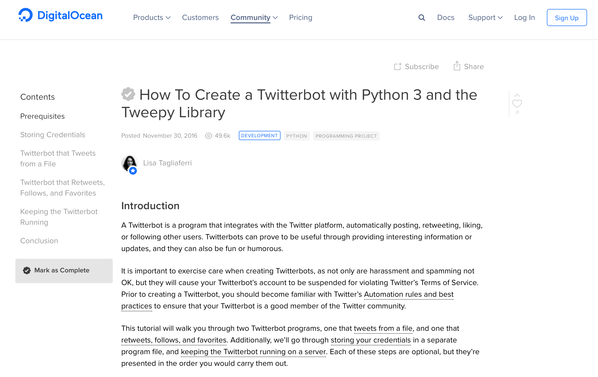

This blog post will detail my learning process en route to creating [Ovid Bot](https://twitter.com/ovid_bot), a Twitter bot that tweets out a random line of Ovid's poetry every six hours. I'll talk first about the [backstory](#backstory) and then about [the process of creating the bot](#process).

# <a name="backstory">Backstory</a>

For the past few months, I've been playing with [CLTK](http://cltk.org)'s corpora in an attempt to create plain text files of the texts that I'm interested in working with for my scholarly projects. If you have some coding literacy, check out the documentation on importing their corpora [here](http://docs.cltk.org/en/latest/importing_corpora.html). It's an impressive set of documents in varying formats (HTML, XML, etc.) from a number of different sources, including Perseus, Latin Library, Lacus Curtius, and others.

It will come as no surprise that the first author for whom I wanted to gain a set of plain text files was Ovid. So, I embarked upon a quite rabbit-hole-ey journey to learn about how to use Python and lxml to scrape the XML files for Ovid's works into a text file for each book of the work under consideration. In the process, I learned more about bash as well to create empty text files with brace expansion.

This was me:

This was me when I started working on more than one text and learned how inconsistent the XML tag and attribute conventions were from one text to the next, even within the same author:

In any case, this is still a work in progress, but I currently have text files for Ovid's *Metamorphoses* and *Fasti* and Homer's *Iliad* and *Odyssey*.

Since I started learning how to code, I've been trying to come up with some easy, low-level projects that I could work on to increase my Pythonic literacy. I've worked on most of them locally on my computer, including word search and word frequency functions and constructions of sentences across line breaks in poetry. If you're interested in any of those, you can browse the `text_library` and `texts` repos on my [Github profile](https://github.com/dlibatique/). Please keep in mind that I'm still very much a newbie programmer, so in addition to the amateurishness of the coding itself, I still need to go through and clean up my documentation and repo structures.

One example of a public-facing project has been my collaboration with Ryan Pasco, [*ergaleia*](https;//ergaleia.github.io), but code-wise, the *ergaleia* website is built with Jekyll and markdown files -- i.e., not much Python to speak of. So, what would be an example of a public-facing, Classics-related project that would use Python?

After Googling around, I got the idea to create a Twitter bot. Bots are of relatively low complexity, and they're malleable enough to test out whatever coding skills you want to leverage. Twitter bots have also been used for Classical purposes, including [Sappho Bot](https://twitter.com/sapphobot) and Pat Burns' [Daily Ovid](https://twitter.com/dailyovid). So, the learning process began!

# <a name="process">The Process of Creating the Bot</a>

If there's one thing that can be said about coding resources online, it's that they're ubiquitous. Really, really, really ubiquitous. To the point of being overwhelming. A quick Google search for "how to create a Twitter bot with Python" returns over 7 million results (!!). The first few were all tutorials aimed at bots that did certain things. [freeCodeCamp's tutorial](https://medium.freecodecamp.org/creating-a-twitter-bot-in-python-with-tweepy-ac524157a607) builds a bot that follows back everyone that follows you, favorites and retweets a tweet based on keywords, and replies to a user based on a keyword. [Scotch's bot](https://scotch.io/tutorials/build-a-tweet-bot-with-python) takes an image and scrambles it like a puzzle. [Dototot's bot](https://dototot.com/how-to-write-a-twitter-bot-with-python-and-tweepy/) was closer to what I wanted to do; it reads from a text file and tweets out a line at set intervals. I wanted to up the difficulty, though, by randomizing which line would be tweeted at any time, and I also found Dototot's a little lacking in how to maintain the bot.

My favorite and the most comprehensive for my purposes was [Digital Ocean's tutorial](https://www.digitalocean.com/community/tutorials/how-to-create-a-twitterbot-with-python-3-and-the-tweepy-library). Like the others, it explains how to set up  Twitter authentication and the code needed for the desired output tweets; unlike the others, it explains in depth how to maintain the bot, even when you don't keep the process actively running in your Terminal.

Before any of this, though, I had to work locally to make sure that I had a solid list of lines and the code to randomly select a line from them. Luckily, through my `text_library` experiments, I had text files for Ovid's *Metamorphoses* ready, so that's where I began.

<blockquote class="twitter-tweet" data-lang="en">
Jumping back into coding and working on creating a bot that tweets out a random line from Ovid&#39;s Met. every so often. Almost there, but trying to figure out why this one empty line at the end of my list of lines (seen in second screenshot) isn&#39;t deleting ... <a href="https://twitter.com/hashtag/Python?src=hash&amp;ref_src=twsrc%5Etfw">#Python</a> <a href="https://twitter.com/hashtag/DigiClass?src=hash&amp;ref_src=twsrc%5Etfw">#DigiClass</a> <a href="https://t.co/EmLa5eVMSf">pic.twitter.com/EmLa5eVMSf</a>
&mdash; Daniel Libatique (@DLibatique10) <a href="https://twitter.com/DLibatique10/status/1006963354282479617?ref_src=twsrc%5Etfw">June 13, 2018</a></blockquote> 

I was able to put the lines of all 15 books of the *Met.* together in one list, but when I tried to go through the master list and delete any empty lines, I was consistently left with one empty line at the very end that wouldn't delete, no matter how hard I tried. I even wrote a function to try to determine whether there were any empty lines left, and the only thing my function would return was this one. Stupid. Line.

A rather hostile answer to my question about it on Stack Overflow (rather uncharacteristically, as Stack Overflow is usually full of very helpful and nice people) informed me in no uncertain terms that I could not iterate over and modify a list at the same time, as I was doing at lines 13-15 of the code in the tweet above.

Assists from Willis Monroe and Pat Burns got me where I eventually needed to be.

<blockquote class="twitter-tweet" data-conversation="none" data-lang="en">
Not sure if we&#39;re using the same dataset, but I tried it on the CLTK Latin corpus files for Ovid&#39;s Metamorphoses, and this works... <a href="https://t.co/p6YweLqQzf">pic.twitter.com/p6YweLqQzf</a>
&mdash; willismonroe (@willismonroe) <a href="https://twitter.com/willismonroe/status/1006981858414899200?ref_src=twsrc%5Etfw">June 13, 2018</a></blockquote> 

<blockquote class="twitter-tweet" data-lang="en">
For reference: <a href="https://t.co/Evoz1f6DLb">https://t.co/Evoz1f6DLb</a>
&mdash; Patrick J. Burns (@diyclassics) <a href="https://twitter.com/diyclassics/status/1006992572923961344?ref_src=twsrc%5Etfw">June 13, 2018</a></blockquote> 

Willis' solution was far more simple than the one that further diving through Stack Overflow had led me to:

And Pat's recommendation was simpler still in that CLTK's line tokenizer does the work of stripping away the empty lines for you. Once that issue was all set, it was easy enough to add those lines to the master list and then use Python's built-in `random` module to select a line randomly.

The combination of the Twitter authentication and bot maintenance elements of Digital Ocean's tutorial with the line randomizer code that I had written with the help of Willis, Pat, and the hostile responder on Stack Overflow (still not over it), I was able to put together [Ovid Bot](https://twitter.com/ovid_bot)! The next steps will be to add all of Ovid's other poems into the mix (as the *Met.* is currently the only source of lines for the bot), but in order to do so, I need to return to the process I described at the beginning of this blog post to scrape the XML for plain text files. I had recently given up because the *Amores*, *Heroides*, *Medicamina*, *Ars Amatoria*, and *Remedia Amoris* are all included in the same XML file with varying and different levels of chunking that will make a single pass at parsing difficult.

But I do love a good challenge!
